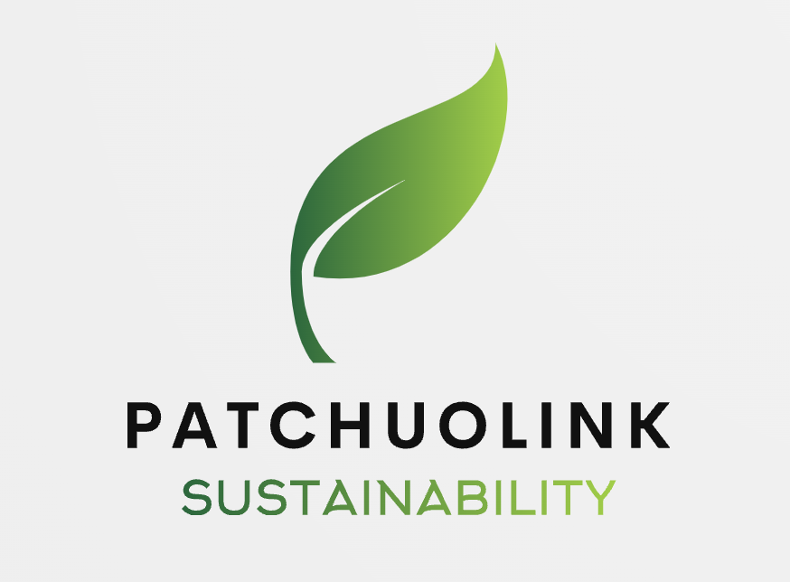

# Patchuolink
<!-- PROJECT LOGO -->
<br />
<div align="center">
    
  </a>
</div>


<details>
  <summary> ## Table of Contents</summary>
  <ol>
    <li>
      <a href="#about-the-project">About The Project</a>
      <ul>
        <li><a href="#built-with">Built With</a></li>
      </ul>
    </li>
    <li>
      <a href="#getting-started">Getting Started</a>
      <ul>
        <li><a href="#prerequisites">Prerequisites</a></li>
        <li><a href="#installation">Installation</a></li>
      </ul>
    </li>
    <li><a href="#usage">Usage</a></li>
    <li><a href="#roadmap">Roadmap</a></li>
    <li><a href="#contributing">Contributing</a></li>
    <li><a href="#license">License</a></li>
    <li><a href="#contact">Contact</a></li>
    <li><a href="#acknowledgments">Acknowledgments</a></li>
  </ol>
</details>


<!-- ABOUT THE PROJECT -->
## About The Project
<br />
<div align="center">
    
  </a>
</div>

There are many great README templates available on GitHub; however, I didn't find one that really suited my needs so I created this enhanced one. I want to create a README template so amazing that it'll be the last one you ever need -- I think this is it.

Here's why:
* Your time should be focused on creating something amazing. A project that solves a problem and helps others
* You shouldn't be doing the same tasks over and over like creating a README from scratch
* You should implement DRY principles to the rest of your life :smile:

Of course, no one template will serve all projects since your needs may be different. So I'll be adding more in the near future. You may also suggest changes by forking this repo and creating a pull request or opening an issue. Thanks to all the people have contributed to expanding this template!

Use the `BLANK_README.md` to get started.


### Built With
## Node

## Hub
```bash
< PROJECT ROOT >
  |
  |
  |-- mysql_database/                     # integration and database file
  |    |-- hubdemo.sql                    # creating the database
  |    |    |-- home_chatgptbot           # record the conversation with openai api chatbot
  |    |    |-- history_update            # record the update history for each round for all the nodes
  |    |    |-- node_info                 # record the node related information, like geographical location and last update time...
  |    |-- loading_ver3.py                # convert the serial monitor data in arduino to SQL database, with simple cleaning and query within
  |    |-- urls.py                        #
  |    |-- 
  |
  |
  |
  |
  |
```
## Original Design Document


## Contact


## Acknowledgments
Use this space to list resources you find helpful and would like to give credit to. I've included a few of my favorites to kick things off!


